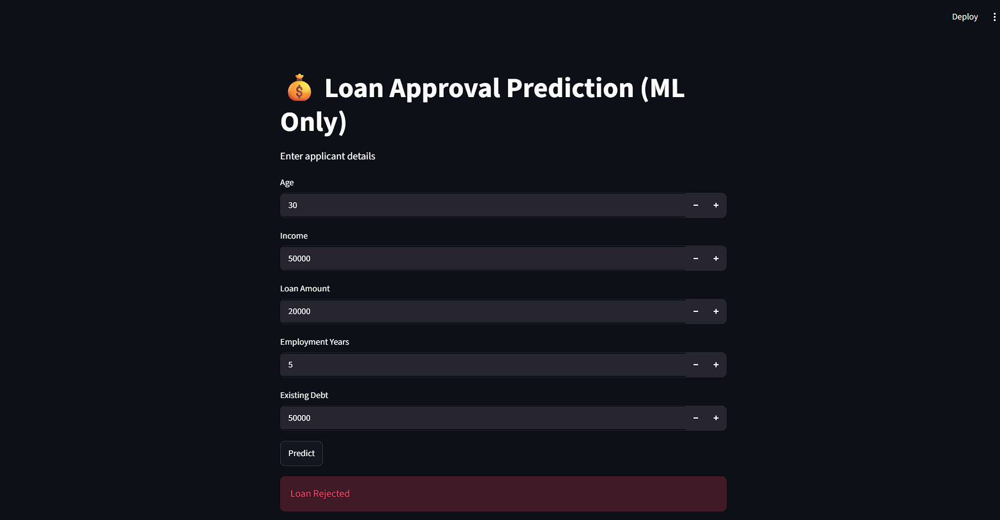
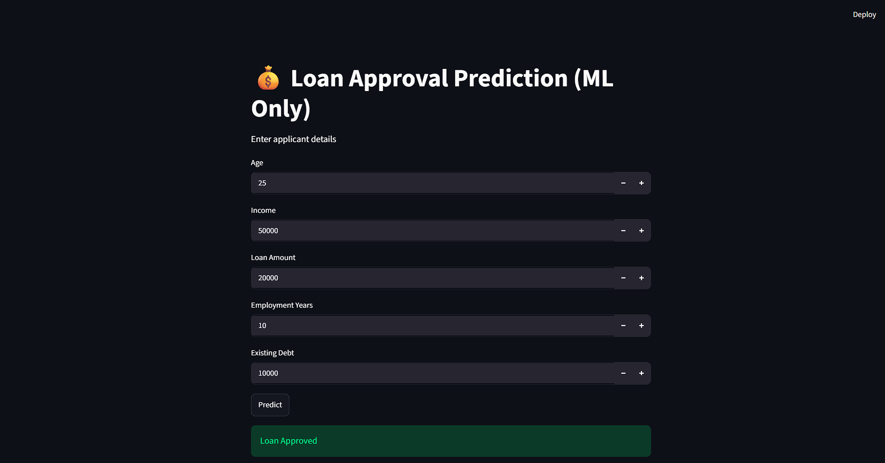
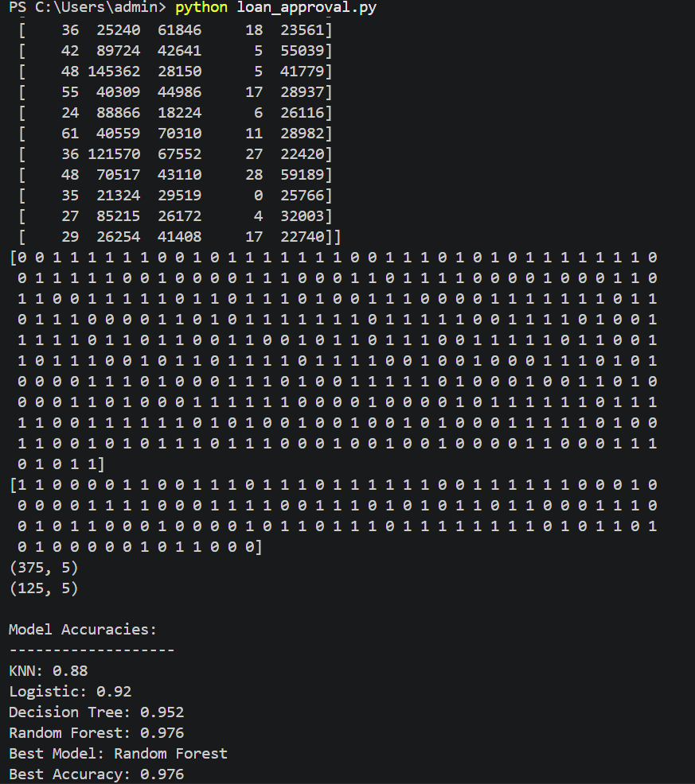

# 💰 LoanScope – Loan Approval Prediction System

LoanScope is a Machine Learning web application that predicts whether a loan will be approved or rejected based on applicant financial data. The system automatically compares multiple ML models and selects the best-performing one.

---

## 📊 Project Overview

This project analyzes financial data such as income, debt, loan amount, and employment history to predict loan approval status using machine learning algorithms.

The system:
- Trains multiple ML models
- Compares accuracy
- Automatically selects the best model
- Deploys prediction via Streamlit UI

---

## 🧠 Features

- Multiple ML models (KNN, Logistic Regression, Decision Tree, Random Forest)
- Automatic best model selection
- Data preprocessing with StandardScaler
- Real-time prediction using Streamlit
- Simple and interactive UI

---

## 📁 Dataset Features

- Age  
- Income  
- Loan Amount  
- Employment Years  
- Existing Debt  
- Approved (Target)

---

## 📁 Project Structure

```text
LoanScope/
│
├── app.py
├── model_train.py
├── model.pkl
├── scaler.pkl
├── loan_approval_large.csv
├── requirements.txt
├── README.md
│
└── Screenshots/
    ├── reject.png
    ├── approved.png
    └── best-choice.png

```
---

## ⚙️ Tech Stack

- Python 🐍  
- Pandas & NumPy  
- Scikit-learn 🤖  
- Streamlit 🌐  
- Pickle (Model Saving)

---

## 🏆 Model Workflow

1. Load dataset  
2. Preprocess data  
3. Train multiple models  
4. Evaluate accuracy  
5. Select best model  
6. Save model + scaler  
7. Deploy via Streamlit  

---

## 🖥️ Streamlit App




## 📊 Model Output



---

## 🚀 Installation & Run Locally

### 1. Clone the repository

```bash
git clone https://github.com/vl-Arafat/LoanScope.git
```

## 2. Go to project directory

```bash
cd LoanScope
```

## 3. Install required packages

```bash
pip install -r requirements.txt
```

## 4. Train the model (optional)

```bash
python model_train.py
```

## 6. Run Streamlit App
```bash
streamlit run app.py
```
